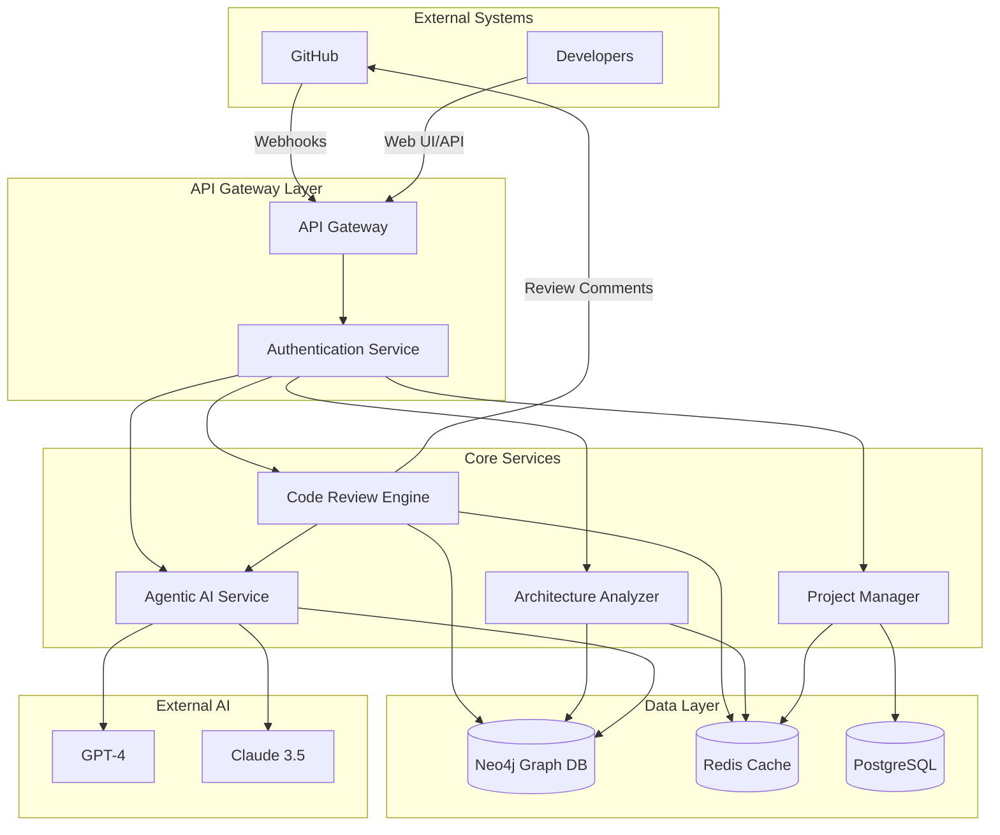

# Design Document: AI-Powered Code Review and Architecture Analysis Platform

## Overview

The AI-powered code review and architecture analysis platform is a comprehensive system that combines automated code quality analysis, graph-based architecture visualization, and agentic AI reasoning to provide intelligent code review and architectural insights for development teams.

The system architecture follows a microservices pattern with distinct components for code analysis, architecture processing, AI reasoning, and project management. The platform integrates seamlessly with GitHub through webhooks and provides real-time feedback directly in pull requests.

Key differentiators from traditional static analysis tools include:
- Graph-based dependency analysis using Neo4j for architectural insights
- Agentic AI reasoning that considers project context for recommendations
- Real-time architectural drift monitoring and prevention
- Enterprise-grade security with role-based access control

## Architecture

The system follows a distributed microservices architecture with the following high-level components:



### Service Communication

Services communicate through:
- **Synchronous**: REST APIs for real-time operations
- **Asynchronous**: Message queues (Redis Pub/Sub) for background processing
- **Event-driven**: Webhook processing and internal event propagation

## Components and Interfaces

### API Gateway

**Purpose**: Single entry point for all external requests, handles routing, rate limiting, and basic authentication.

**Key Interfaces**:
```typescript
interface APIGateway {
  routeRequest(request: HTTPRequest): Promise<HTTPResponse>
  authenticateRequest(request: HTTPRequest): Promise<AuthContext>
  applyRateLimit(clientId: string): Promise<boolean>
}
```

### Authentication Service

**Purpose**: Manages user authentication, authorization, and role-based access control.

**Key Interfaces**:
```typescript
interface AuthenticationService {
  authenticate(credentials: Credentials): Promise<AuthToken>
  authorize(token: AuthToken, resource: string, action: string): Promise<boolean>
  getUserRoles(userId: string): Promise<Role[]>
}

interface Role {
  name: 'administrator' | 'programmer' | 'visitor'
  permissions: Permission[]
}
```

### Code Review Engine

**Purpose**: Processes code changes, performs quality analysis, and generates review comments.

**Key Interfaces**:
```typescript
interface CodeReviewEngine {
  processWebhook(payload: GitHubWebhookPayload): Promise<void>
  analyzeCodeChanges(changes: CodeDiff[]): Promise<ReviewResult>
  generateReviewComments(analysis: ReviewResult): Promise<ReviewComment[]>
  postCommentsToGitHub(comments: ReviewComment[], prNumber: number): Promise<void>
}

interface ReviewResult {
  qualityIssues: QualityIssue[]
  securityVulnerabilities: SecurityIssue[]
  standardViolations: StandardViolation[]
  architecturalConcerns: ArchitecturalIssue[]
}
```

### Architecture Analyzer

**Purpose**: Parses source code, extracts dependencies, and maintains the architectural graph database.

**Key Interfaces**:
```typescript
interface ArchitectureAnalyzer {
  parseSourceCode(files: SourceFile[]): Promise<AST[]>
  extractDependencies(ast: AST[]): Promise<Dependency[]>
  updateArchitectureGraph(dependencies: Dependency[]): Promise<void>
  detectArchitecturalDrift(): Promise<DriftAlert[]>
  generateArchitectureDiagram(projectId: string): Promise<ArchitectureDiagram>
}

interface Dependency {
  source: ComponentIdentifier
  target: ComponentIdentifier
  type: 'imports' | 'extends' | 'implements' | 'calls' | 'instantiates'
  strength: number
}
```

### Agentic AI Service

**Purpose**: Provides contextual AI reasoning, pattern recognition, and intelligent recommendations.

**Key Interfaces**:
```typescript
interface AgenticAIService {
  analyzeCodeWithContext(code: string, context: ProjectContext): Promise<AIAnalysis>
  recognizePatterns(codeStructure: CodeStructure): Promise<PatternMatch[]>
  generateRecommendations(analysis: AIAnalysis): Promise<Recommendation[]>
  simulateArchitecturalChanges(proposedChanges: ArchitecturalChange[]): Promise<SimulationResult>
  switchModel(modelType: 'gpt-4' | 'claude-3.5'): Promise<void>
}

interface ProjectContext {
  architecturalGraph: GraphSnapshot
  codebaseMetrics: CodebaseMetrics
  historicalPatterns: HistoricalPattern[]
  teamPreferences: TeamPreferences
}
```

### Project Manager

**Purpose**: Manages project lifecycle, task queues, and provides dashboard functionality.

**Key Interfaces**:
```typescript
interface ProjectManager {
  createProject(config: ProjectConfig): Promise<Project>
  queueAnalysisTask(task: AnalysisTask): Promise<TaskId>
  getTaskStatus(taskId: TaskId): Promise<TaskStatus>
  generateDashboard(userId: string): Promise<Dashboard>
  getProjectMetrics(projectId: string): Promise<ProjectMetrics>
}

interface Dashboard {
  activeProjects: ProjectSummary[]
  queueStatus: QueueMetrics
  recentAnalyses: AnalysisResult[]
  architecturalHealth: HealthMetrics
}
```

## Data Models

### Core Entities

```typescript
// Project and Repository Management
interface Project {
  id: string
  name: string
  repositoryUrl: string
  configuration: ProjectConfiguration
  createdAt: Date
  lastAnalyzed: Date
  status: 'active' | 'paused' | 'archived'
}

interface ProjectConfiguration {
  analysisRules: AnalysisRule[]
  qualityThresholds: QualityThreshold[]
  architecturalConstraints: ArchitecturalConstraint[]
  integrationSettings: IntegrationSettings
}

// Code Analysis Results
interface AnalysisResult {
  id: string
  projectId: string
  pullRequestId: string
  timestamp: Date
  codeChanges: CodeChange[]
  qualityScore: number
  issues: Issue[]
  recommendations: Recommendation[]
}

interface Issue {
  type: 'quality' | 'security' | 'architecture' | 'standards'
  severity: 'low' | 'medium' | 'high' | 'critical'
  description: string
  location: CodeLocation
  suggestedFix?: string
  ruleViolated: string
}

// Architectural Graph Models
interface ArchitecturalNode {
  id: string
  type: 'class' | 'function' | 'module' | 'package'
  name: string
  filePath: string
  metrics: NodeMetrics
  properties: Record<string, any>
}

interface ArchitecturalEdge {
  id: string
  sourceId: string
  targetId: string
  relationship: RelationshipType
  weight: number
  properties: Record<string, any>
}

// User and Authentication
interface User {
  id: string
  email: string
  name: string
  roles: Role[]
  preferences: UserPreferences
  lastLogin: Date
}

interface AuthToken {
  userId: string
  roles: string[]
  permissions: string[]
  expiresAt: Date
  refreshToken: string
}
```

### Graph Database Schema

The Neo4j graph database stores architectural relationships with the following node types and relationships:

**Node Types**:
- `Project`: Root node for each analyzed project
- `Module`: Represents code modules/packages
- `Class`: Represents classes and interfaces
- `Function`: Represents functions and methods
- `File`: Represents source files

**Relationship Types**:
- `CONTAINS`: Hierarchical containment (Project → Module → Class → Function)
- `IMPORTS`: Import dependencies between modules
- `EXTENDS`: Inheritance relationships
- `IMPLEMENTS`: Interface implementation
- `CALLS`: Function call relationships
- `DEPENDS_ON`: General dependency relationships

## Error Handling

### Error Categories

1. **Integration Errors**: GitHub API failures, webhook delivery issues
2. **Analysis Errors**: Code parsing failures, AI service timeouts
3. **Data Errors**: Database connection issues, graph query failures
4. **Authentication Errors**: Invalid tokens, insufficient permissions
5. **System Errors**: Service unavailability, resource exhaustion

### Error Handling Strategy

```typescript
interface ErrorHandler {
  handleIntegrationError(error: IntegrationError): Promise<ErrorResponse>
  handleAnalysisError(error: AnalysisError): Promise<ErrorResponse>
  handleSystemError(error: SystemError): Promise<ErrorResponse>
}

interface ErrorResponse {
  code: string
  message: string
  retryable: boolean
  retryAfter?: number
  context?: Record<string, any>
}
```

**Retry Policies**:
- GitHub API calls: Exponential backoff with jitter, max 3 retries
- AI service calls: Linear backoff, max 2 retries with model fallback
- Database operations: Immediate retry once, then circuit breaker
- Webhook processing: Dead letter queue after 3 failed attempts

**Circuit Breaker Pattern**: Implemented for external service calls with:
- Failure threshold: 5 consecutive failures
- Timeout: 30 seconds
- Half-open retry interval: 60 seconds

## Testing Strategy

The testing strategy employs a dual approach combining unit tests for specific scenarios and property-based tests for comprehensive validation of universal properties.

### Unit Testing Approach

Unit tests focus on:
- **Integration Points**: GitHub webhook processing, AI service integration
- **Edge Cases**: Malformed code, empty repositories, large codebases
- **Error Conditions**: Network failures, authentication errors, parsing failures
- **Business Logic**: Role-based access control, quality threshold evaluation

### Property-Based Testing Approach

Property-based tests validate universal correctness properties using a minimum of 100 iterations per test. Each test references its corresponding design document property and uses the tag format: **Feature: ai-code-review-platform, Property {number}: {property_text}**

**Testing Framework Selection**:
- **Backend Services**: Use Hypothesis (Python) or fast-check (TypeScript/JavaScript)
- **Graph Operations**: Custom generators for Neo4j graph structures
- **AI Integration**: Mock-based testing with property validation of response formats

**Test Configuration**:
- Minimum 100 iterations per property test
- Randomized input generation for code structures, user roles, and project configurations
- Comprehensive coverage of architectural graph operations and transformations

## Correctness Properties

*A property is a characteristic or behavior that should hold true across all valid executions of a system—essentially, a formal statement about what the system should do. Properties serve as the bridge between human-readable specifications and machine-verifiable correctness guarantees.*

### Property 1: Pull Request Analysis Timing
*For any* pull request event, when the Code Review Engine processes it, analysis should complete within the specified time limits (30 seconds for trigger, 5 minutes for large changes)
**Validates: Requirements 1.1, 10.1**

### Property 2: Webhook Processing Reliability
*For any* GitHub webhook payload, the system should successfully extract code differences and metadata within 5 seconds, with proper retry logic for failures
**Validates: Requirements 2.2, 2.3, 2.4**

### Property 3: Comprehensive Code Analysis
*For any* code changes submitted for review, the analysis engine should identify all categories of issues (logical flaws, security vulnerabilities, standard violations) and generate actionable comments
**Validates: Requirements 1.2, 1.3, 1.4**

### Property 4: Authentication and Authorization Consistency
*For any* user request to protected resources, the authentication system should correctly verify permissions based on assigned roles and log security events appropriately
**Validates: Requirements 6.1, 6.2, 6.4, 6.5**

### Property 5: Graph Database Architecture Processing
*For any* source code repository, the Architecture Analyzer should successfully parse code to AST, extract dependencies, and store relationships in the graph database
**Validates: Requirements 4.1, 4.2, 4.3**

### Property 6: Architectural Drift Detection
*For any* architectural changes in a monitored repository, the system should detect violations (circular dependencies, unexpected coupling) and generate appropriate warnings within specified time limits
**Validates: Requirements 4.5, 5.1, 5.2, 5.3, 5.5**

### Property 7: AI Model Integration and Switching
*For any* supported AI model (GPT-4, Claude 3.5), the Agentic AI service should successfully process analysis requests and allow dynamic switching between models
**Validates: Requirements 3.1, 3.5**

### Property 8: Contextual AI Reasoning
*For any* code analysis request, the Agentic AI should consider project context from the graph database, provide explanations for recommendations, and adapt suggestions based on project characteristics
**Validates: Requirements 3.4, 9.1, 9.2, 9.3, 9.4, 9.5**

### Property 9: Pattern Recognition and Knowledge Base
*For any* code sample analyzed, the system should identify violations of established best practices, recognize anti-patterns, and reference specific standards in recommendations
**Validates: Requirements 8.1, 8.2, 8.3, 8.4, 8.5**

### Property 10: Project Management and Tracking
*For any* project or analysis task, the Project Manager should correctly track status, provide accurate metrics, generate reports, and maintain queue management
**Validates: Requirements 7.1, 7.2, 7.3, 7.4, 7.5**

### Property 11: System Scalability and Performance
*For any* system load condition, the platform should handle concurrent requests through proper queueing, support large repositories, and automatically scale processing capacity
**Validates: Requirements 10.2, 10.3, 10.5**

### Property 12: Clean Code Principle Validation
*For any* code submitted for analysis, the Agentic AI should identify Clean Code principle violations and provide explanations for identified issues
**Validates: Requirements 3.2, 3.3**

### Property 13: GitHub Integration Completeness
*For any* GitHub integration configuration, the system should properly authenticate, capture all relevant events, and post review comments back to pull requests
**Validates: Requirements 2.1, 2.5, 1.5**

### Property 14: Architecture Visualization and Monitoring
*For any* project with architectural data, the system should generate dynamic visualizations, track metrics over time, and provide trend analysis
**Validates: Requirements 4.4, 5.4**

### Property 15: Data Security and Access Control
*For any* sensitive data (architecture configuration, analysis reports), the system should enforce proper access controls based on user roles and maintain audit compliance
**Validates: Requirements 6.3**