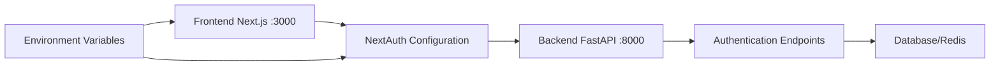

# Design Document: NextAuth Backend Integration Fix

## Overview

This design addresses the authentication configuration issues between the Next.js frontend and FastAPI backend. The primary problem is that NextAuth is attempting to authenticate against the wrong URL (frontend port instead of backend port), causing authentication failures.

The solution involves updating the NextAuth configuration to properly use environment variables for backend communication, ensuring proper error handling, and establishing a reliable authentication flow between the frontend and backend services.

## Architecture

### Current Architecture Issues
- NextAuth configured to use `http://localhost:3000/api/v1/auth/login` (frontend port)
- Backend API actually running on `http://localhost:8000/api/v1/auth/login`
- Missing environment variable configuration for NextAuth
- No proper error handling for configuration issues

### Target Architecture


### Communication Flow
1. User submits credentials through frontend form
2. NextAuth processes credentials using configured provider
3. NextAuth makes HTTP request to backend API at correct URL
4. Backend validates credentials and returns user data
5. NextAuth creates session and returns tokens to frontend

## Components and Interfaces

### 1. Environment Configuration
**File:** `frontend/.env.local` (to be created)
```typescript
interface EnvironmentConfig {
  NEXTAUTH_URL: string;           // Frontend base URL
  NEXTAUTH_SECRET: string;        // Session encryption secret
  NEXT_PUBLIC_API_URL: string;    // Backend API base URL
  NODE_ENV: string;               // Environment mode
}
```

### 2. NextAuth Configuration Updates
**File:** `frontend/src/app/api/auth/[...nextauth]/route.ts`
```typescript
interface AuthOptions {
  providers: Provider[];
  callbacks: {
    jwt: (params: JWTParams) => Promise<JWT>;
    session: (params: SessionParams) => Promise<Session>;
  };
  pages: {
    signIn: string;
    error: string;
  };
  session: {
    strategy: 'jwt';
    maxAge: number;
  };
  secret: string;
  debug: boolean;
}

interface CredentialsProvider {
  name: string;
  credentials: Record<string, CredentialInput>;
  authorize: (credentials: Credentials) => Promise<User | null>;
}
```

### 3. Authentication Service
**File:** `frontend/src/lib/auth.ts` (to be created)
```typescript
interface AuthService {
  login(credentials: LoginCredentials): Promise<AuthResponse>;
  validateResponse(response: Response): Promise<User>;
  handleAuthError(error: Error): AuthError;
}

interface LoginCredentials {
  email: string;
  password: string;
}

interface AuthResponse {
  user: User;
  tokens?: {
    access_token: string;
    refresh_token: string;
  };
}
```

## Data Models

### User Model (Frontend)
```typescript
interface User {
  id: string;
  email: string;
  name?: string;
  full_name?: string;
  role?: string;
  is_active?: boolean;
}
```

### Authentication Error Model
```typescript
interface AuthError {
  type: 'configuration' | 'network' | 'credentials' | 'server';
  message: string;
  details?: string;
  statusCode?: number;
}
```

## Correctness Properties

*A property is a characteristic or behavior that should hold true across all valid executions of a system-essentially, a formal statement about what the system should do. Properties serve as the bridge between human-readable specifications and machine-verifiable correctness guarantees.*

### Property Reflection

After analyzing all acceptance criteria, I identified several properties that can be consolidated:
- Properties 1.1, 1.3, and 3.1 all relate to correct URL routing and can be combined into a comprehensive URL correctness property
- Properties 2.1, 2.2, and 2.3 all relate to environment variable usage and can be combined into a configuration property
- Properties 1.4, 4.2, and 4.3 all relate to error handling and can be combined into an error handling property
- Properties 4.1 and 4.4 relate to logging and debugging and can be combined

### Property 1: Authentication URL Correctness
*For any* authentication request, the system should route the request to the backend API URL constructed from the NEXT_PUBLIC_API_URL environment variable, ensuring all authentication attempts reach the correct backend endpoint.
**Validates: Requirements 1.1, 1.3, 3.1**

### Property 2: Environment Variable Configuration
*For any* NextAuth configuration loading, the system should correctly read and apply NEXT_PUBLIC_API_URL, NEXTAUTH_URL, and NEXTAUTH_SECRET environment variables to the authentication configuration.
**Validates: Requirements 2.1, 2.2, 2.3**

### Property 3: Fallback Configuration Behavior
*For any* missing environment variable, the system should fall back to sensible development defaults and continue functioning with appropriate warnings.
**Validates: Requirements 2.4**

### Property 4: Authentication Response Handling
*For any* backend authentication response (success or failure), the frontend should properly parse the response and establish the correct session state or error state.
**Validates: Requirements 3.2, 3.3**

### Property 5: Error Handling and Messaging
*For any* authentication error (configuration, network, or credentials), the system should provide clear, specific error messages and handle the error gracefully without crashing.
**Validates: Requirements 1.4, 3.4, 4.2, 4.3**

### Property 6: Development Logging
*For any* authentication operation when NODE_ENV is set to development, the system should provide detailed logging and debugging information.
**Validates: Requirements 4.1, 4.4**

## Error Handling

### Configuration Errors
- Missing environment variables should trigger clear error messages
- Invalid URLs should be detected and reported with specific guidance
- Malformed secrets should be caught during initialization

### Network Errors
- Backend unreachable: Graceful degradation with retry logic
- Timeout handling: Configurable timeout with user feedback
- Connection refused: Clear error message indicating backend status

### Authentication Errors
- Invalid credentials: User-friendly error messages
- Expired tokens: Automatic refresh attempt before failing
- Server errors: Detailed logging for debugging while showing generic user message

### Error Recovery
- Automatic retry for transient network issues
- Fallback to cached session data when possible
- Clear recovery instructions for configuration issues

## Testing Strategy

### Unit Tests
- Environment variable parsing and validation
- URL construction from configuration
- Error message generation for various failure scenarios
- Authentication response parsing and validation

### Property-Based Tests
Property-based testing will validate universal properties across many generated inputs using Jest and fast-check library. Each test will run a minimum of 100 iterations.

**Configuration**: 
- Test framework: Jest with fast-check
- Minimum iterations: 100 per property test
- Tag format: **Feature: nextauth-backend-integration, Property {number}: {property_text}**

**Property Test Implementation**:
- Property 1: Generate various environment configurations and verify URL construction
- Property 2: Generate different environment variable combinations and verify configuration loading
- Property 3: Test fallback behavior with missing environment variables
- Property 4: Generate various backend responses and verify frontend handling
- Property 5: Generate different error conditions and verify error handling
- Property 6: Test logging behavior across different NODE_ENV values

### Integration Tests
- End-to-end authentication flow testing
- Backend communication verification
- Session management validation
- Error handling across component boundaries

The dual testing approach ensures both specific examples work correctly (unit tests) and universal properties hold across all inputs (property tests), providing comprehensive coverage of the authentication system.

<function_calls>
<invoke name="prework">
<parameter name="featureName">nextauth-backend-integration